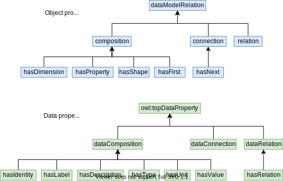
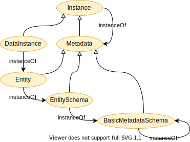

Datamodel Ontology
==================

Content
-------
- [Overview](#overview)
- [Short description of the data model ontology](#short-description-of-the-data-model-ontology)
  - [Entity](#entity)
  - [Relations](#relations)
  - [Metamodel](#metamodel)
  - [Connection to EMMO](#connection-to-emmo)
- [The provided turtle files](#the-provided-turtle-files)
- [Usage example](#usage-example)
- [References](#references)
- [Attributions and credits](#attributions-and-credits)
  - [Contributing projects](#contributing-projects)
  - [Contributors and contacts](#contributors-and-contacts)
- [License](#license)

Overview
--------
An ontological description of a simple data model aimed to make
application specific data semantic interoperabel.

The basic idea is that the data model should stay very close to the
way the application repesents its data.  At the same time, the data
model allows easy mapping the elements in the data model (entities,
dimensions and properties) to a globally shared ontology and thereby
enable semantic interoperability.

This ontology only describes the data model.  A set of accompanying
tools is needed in order to achieve actual interoperability in real
applications.

Short description of the data model ontology
--------------------------------------------
The root concept in the taxonomy of this ontology is called **DataModel**.

### Entity
The **Entity** is the most central concept in this ontology.  It is the class of individuals that represent any self-contained piece of information.
It id uniquely defined by its IRI. In addition it has the following parts (composition):
- **description**: a human description of the entity.
- **dimensions**: zero or more named dimensions, which are referred to by the property shapes (see below).  A dimension has two parts:
  - **label**: a label identifying the dimension within the entity.
  - **description**: a human description of this dimension.
- **properties**: a set or properties describing the underlying data.  A property has the following paths:
  - **label**: a label identifying the property within the entity.
  - **type**: the data type of the property. More specific types, like integer, float, string etc... are subclasses of Type.  Type may also be a reference to another entity.  The actual type values are implementation-specific and are not included in this ontology.  In future releases type may be changed to a class.
  - **relation**: In case type refer to another entity, relation specifies how this and the other entity are related.
  - **shape**: The shape of the property.  It is a ordered list of DimensionExpressions.  For example `["N", "N+1"]` where "N" is a dimension label.  Actual implementations may leave the shape optional.
  - **unit**: the unit of the property.  Would typically refer to other ontologies, like EMMO, QUDT or OM, or simply be a conventional symbol for the unit (e.g. "km/h").  In future releases unit may be changed to a class.
  - **description**: a human description of the property.

Figure 1 shows the relations between the entity and its parts.

_Figure 1: The relations the Entity parts.  The taxonomy is not shown for clarity._

### Relations
The datamodel ontology categorises its relations in terms of:
- **composition** which describe parthood relations.  It correspond to mereology in EMMO and composition in UML.
- **connection** which describe connections between two concepts.  It correspond to topology in EMMO and the subproperty of UML aggregation that is not a composition.
- **relation** which describe generic relations between concepts that are not connections or compositions.  It correspond to semiotical in EMMO.  In UML it is the subproperty of UML association that is not a aggregation.

As shown in Figure 2 is the same categorisation used for both object and data properties.

_Figure 2: Taxonomy of object properties and data properties._

### Metamodel
A metamodel for the metadata hierarchy, which is not part of the basic entity ontology was suggested in SOFT and implemented in [DLite](https://github.com/SINTEF).  It extends the entity ontology with the following concepts:
- **Metadata**, which is a generalisation of Entity that is able to describe not only data objects, but also entities and other metadata.
- **DataInstance**, which is an instance on an entity representing actual data.
- **Instance**, which is the class of all metadata instances, i.e. what can be described by a Metadata.  It is the disjoint union of Metadata and DataInstance.
- **EntitySchema** is a metadata that can describe an entity (i.e. a meta-metadata).
- **BasicMetadataSchema** is a metadata that can describe an entity schema.  Furthermore it has the ability to describe itself, terminating the metadata hierarchy.

Since metadata are instances of the meta-metadata that describes them, all metadata are also instances. This is similar to Python, where classes (Metadata) are a special kind (subclasses) of Python objects (Instance).

The metadata model is shown in Figure 3.  Note that this multi-level of abstractions requires second order logic to describe.  It can therefore not be described formally in OWL description logic, which is based on first order logic.  Instead we introduce the the `instanceOf` relations as an annotation property.  It is ignored by the reasoner, but should be thought of as having the same semantic meaning as `rdf:type` without the constrain that the domain must be an individual.

OWL2 punning, which is to use the same IRI for both a class and individual, could have been another way to formalise the metadata hierarchy.  However, we would like to avoid that, since punning is not anchored in first order logic.

_Figure 3: The extended metadata hierarchy._

### Connection to EMMO
When connecting to EMMO, the datamodel ontology is describing as a formal language.  That entities are self-contained are reflected in making them subclasses of spatially fundamental wholes.  The entity dimension, property, shape and dimension expression parts are therefore constituents.  Since shape has a finite set of (ordered) dimension expression direct parts, it is a state.  This is shown in Figure 4.

The relations are not shown in Figure 4, but fits very well with EMMO:
- composition -> emmo:hasOverlap (mereological)
- connection -> emmo:isCausallyConnectedWith (topological)
- relation -> emmo:semiotical

_Figure 4: Connection to EMMO._

The provided turtle files
-------------------------
- [entity.ttl](entity.ttl) defines the basic datamodel as a standalone turtle file.
- [metamodel.ttl](metamodel.ttl) imports [entity.ttl](entity.ttl) and extends it with the metadata model.
- [transaction.ttl](transaction.ttl) imports [metamodel.ttl](metamodel.ttl) and extends it with the concept of transactions.  A transaction is an instance that has an immutable parent instance.  This allows for time series and strict provenance.
- [collection.ttl](collection.ttl) import [transaction.ttl](transaction.ttl) and extends it with the concept of collections.  A collection is a special type of instance that contains references to a set of other instances and relations between them.  Collections make it possible to describe complex data structures and can be seen as a local knowledge base.
- [datamodel.ttl](datamodel.ttl) imports [collection.ttl](collection.ttl) and links it to EMMO.

Usage example
-------------
See [docs/serialisation.md](docs/serialisation.md) for an example of how entities and instances can be serialised with the Datamodel Ontology.

References
----------
1. A Practical Approach to Ontology-Based Data Modelling for Semantic Interoperability, https://www.scipedia.com/public/Hagelien_et_al_2021a

Attributions and credits
------------------------

### Contributing projects

- [MarketPlace](https://www.the-marketplace-project.eu/);
  Grant Agreement No: 760173
  
- [OntoTrans](https://ontotrans.eu/project/);
  Grant Agreement No: 862136
  
- [OpenModel](https://openmodel.eu/project/);
  Grant Agreement No: 862136
- [VIPCOAT](https://cordis.europa.eu/project/id/952903)
  Grant Agreement No: 952903

### Contributors and contacts

- Jesper Friis, SINTEF
- Francesca Lønstad Bleken, SINTEF
- Thomas Hagelien, SINTEF

License
-------
The datamodel ontology is released under the [Creative Commons Attribution 4.0 International](https://creativecommons.org/licenses/by/4.0/legalcode) license (CC BY 4.0).
